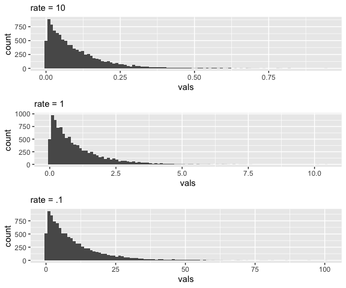
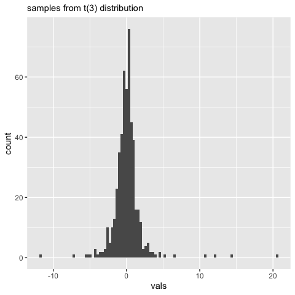
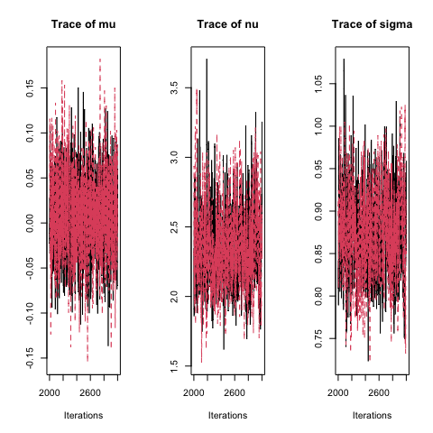
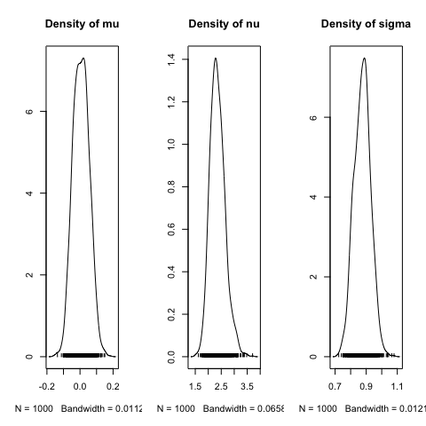

# Activity 11


### Last-Last Week’s Recap

- MCMC algorithms

### This week

- posterior predictive distributions
- t-distributions and t-tests
- p-values
- Region of Practical Equivalence (ROPE)

------------------------------------------------------------------------

### Bayesian modeling with t-distribution

- Sampling model $y \sim t(\mu, \sigma^2, \nu)$

- This requires a prior distribution on:

  - $\mu$: Similiar to the normal sampling model case, we can use a
    normal distribution with $p(\mu) \sim N(M,S^2)$
  - $\sigma^2$: The variance term also has a similar interpretation, so
    we can use a uniform or inverse-gamma distribution for a prior.
  - $\nu$: The term $\nu$ is often called the degrees of freedom, and
    this controls the tail behavior of the distribution. The restriction
    is that the degrees of freedom has to be larger than one. A common
    prior is to use a shifted exponential distribution.



##### JAGS code

``` r
t.samples <- data.frame(rt(500, df = 3))
colnames(t.samples) <- 'vals'
ggplot(data=t.samples, aes(vals)) + geom_histogram(bins = 100) + 
  labs(subtitle = "samples from t(3) distribution")
```



``` r
#Prior parameters
M <- 0
S <- 100
C <- 10
rate <- .1

# Store data
dataList = list(y = t.samples$vals, Ntotal = nrow(t.samples), M = M, S = S, C = C, rate = rate)

# Model String
modelString = "model {
  for ( i in 1:Ntotal ) {
    y[i] ~ dt(mu, 1/sigma^2, nu) # sampling model
  }
  mu ~ dnorm(M,1/S^2)
  sigma ~ dunif(0,C)
  nu <- nuMinusOne + 1 # transform to guarantee n >= 1
  nuMinusOne ~ dexp(rate)
} "
writeLines( modelString, con='Tmodel.txt')

# initialization
initsList <- function(){
  # function for initializing starting place of theta
  # RETURNS: list with random start point for theta
  return(list(mu = rnorm(1, mean = M, sd = S), sigma = runif(1,0,C), 
              nuMinusOne = rexp(1, rate=rate) ))
}

# Runs JAGS Model
jagsT <- jags.model( file = "Tmodel.txt", data = dataList, inits =initsList, 
                     n.chains = 2, n.adapt = 1000)
```

    Compiling model graph
       Resolving undeclared variables
       Allocating nodes
    Graph information:
       Observed stochastic nodes: 500
       Unobserved stochastic nodes: 3
       Total graph size: 516

    Initializing model

``` r
update(jagsT, n.iter = 1000)

num.mcmc <- 1000
codaSamples <- coda.samples( jagsT, variable.names = c('mu', 'sigma','nu'), n.iter = num.mcmc)

par(mfcol=c(1,3))
traceplot(codaSamples)
```



``` r
densplot(codaSamples)
```



``` r
HPDinterval(codaSamples[[1]])
```

               lower     upper
    mu    -0.1556692 0.0422798
    nu     2.1204858 3.9919131
    sigma  0.8518212 1.0817187
    attr(,"Probability")
    [1] 0.95

### 1.

Simulate 100 responses from a Cauchy distribution, t distribution with
$\mu$ = 1, $\sigma^2$=1 and $\nu=1$, and describe this data with a plot
and brief description of the data.

### 2.

Use JAGS to fit a normal sampling model and the following priors for
this data.

- $p(\mu) \sim N(0,10^2)$
- $p(\sigma) \sim U(0,1000)$

### 3.

Use JAGS to fit a t sampling model and the following priors for this
data.

- $p(\mu) \sim N(0,10^2)$
- $p(\sigma) \sim U(0,1000)$
- $p(\nu) \sim E_+(.1)$, where $E_+(.1)$ is a shifted exponential with
  rate = .1.

Discuss the posterior HDIs for $\mu$, $\sigma$, and $\nu$.

### 4.

Create a data visualization to show posterior predictive distributions
for Q2 and Q3. Remember this can be done using your posterior samples
and combining them with your sampling model. Compare the data and the
posterior predictive model curves with posterior predictive models. Note
this is the final step in Bayesian data analysis: verifying that our
model / prior selection is an accurate representation of the data.

### T-test

For this question, we will initially use classical t-tests.

First write down the statistical model you are using for each of the
following scenarios.

Use the OK Cupid dataset and test the following claim, the mean height
OK Cupid respondents reporting their body type as athletic is different
than 70 inches.

``` r
okc <- read_csv('http://www.math.montana.edu/ahoegh/teaching/stat408/datasets/OKCupid_profiles_clean.csv')
```

    Rows: 22123 Columns: 10
    ── Column specification ────────────────────────────────────────────────────────
    Delimiter: ","
    chr (8): body_type, diet, drinks, drugs, ethnicity, job, sex, smokes
    dbl (2): age, height

    ℹ Use `spec()` to retrieve the full column specification for this data.
    ℹ Specify the column types or set `show_col_types = FALSE` to quiet this message.

Now consider whether there is a height difference between OK Cupid
respondents self-reporting their body type as “athletic” and those
self-reporting their body type as “fit”

Next, use the idea of a ROPE and redo the previous analyses using JAGS.
