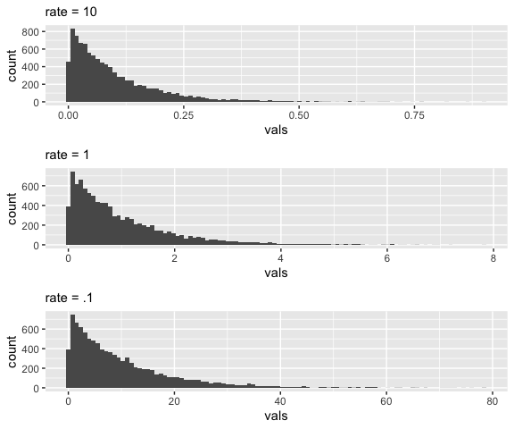
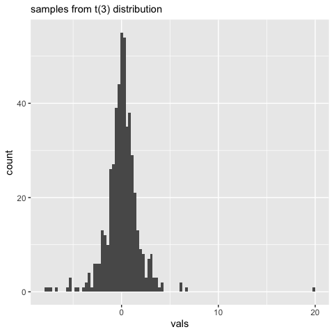
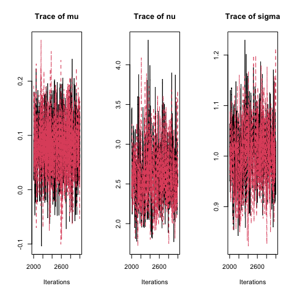
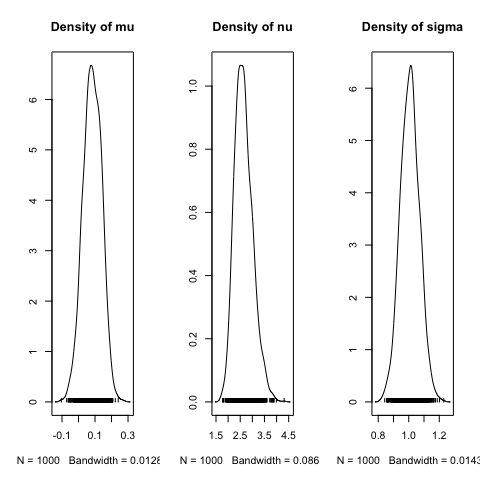
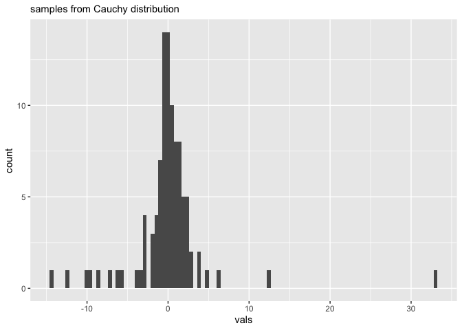
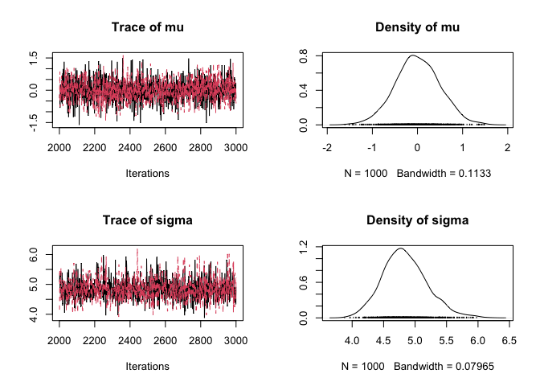
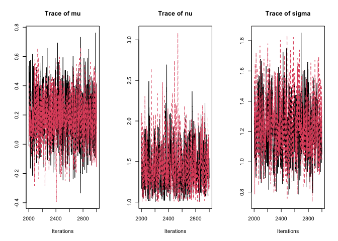
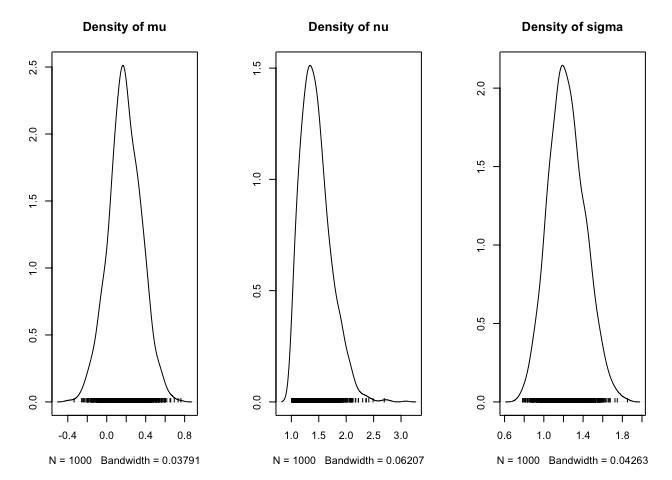
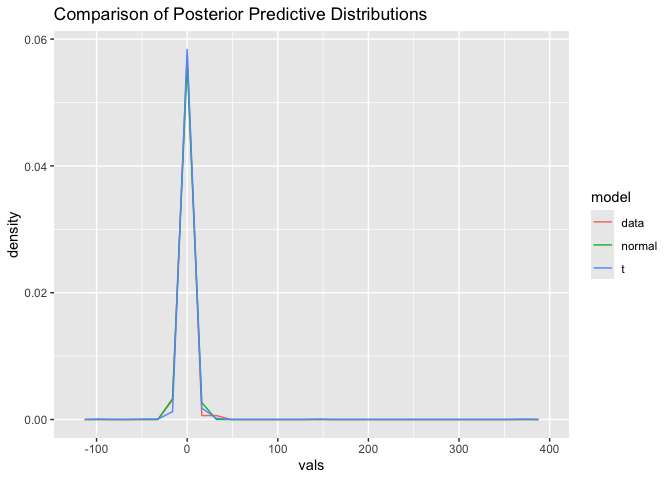

# Activity 11: key


### Last-Last Week’s Recap

- MCMC algorithms

### This week

- posterior predictive distributions
- t-distributions and t-tests
- p-values
- Region of Practical Equivalence (ROPE)

------------------------------------------------------------------------

### Bayesian modeling with t-distribution

- Sampling model $y \sim t(\mu, \sigma^2, \nu)$

- This requires a prior distribution on:

  - $\mu$: Similiar to the normal sampling model case, we can use a
    normal distribution with $p(\mu) \sim N(M,S^2)$
  - $\sigma^2$: The variance term also has a similar interpretation, so
    we can use a uniform or inverse-gamma distribution for a prior.
  - $\nu$: The term $\nu$ is often called the degrees of freedom, and
    this controls the tail behavior of the distribution. The restriction
    is that the degrees of freedom has to be larger than one. A common
    prior is to use a shifted exponential distribution.



##### JAGS code

``` r
t.samples <- data.frame(rt(500, df = 3))
colnames(t.samples) <- 'vals'
ggplot(data=t.samples, aes(vals)) + geom_histogram(bins = 100) + 
  labs(subtitle = "samples from t(3) distribution")
```



``` r
#Prior parameters
M <- 0
S <- 100
C <- 10
rate <- .1

# Store data
dataList = list(y = t.samples$vals, Ntotal = nrow(t.samples), M = M, S = S, C = C, rate = rate)

# Model String
modelString = "model {
  for ( i in 1:Ntotal ) {
    y[i] ~ dt(mu, 1/sigma^2, nu) # sampling model
  }
  mu ~ dnorm(M,1/S^2)
  sigma ~ dunif(0,C)
  nu <- nuMinusOne + 1 # transform to guarantee n >= 1
  nuMinusOne ~ dexp(rate)
} "
writeLines( modelString, con='Tmodel.txt')

# initialization
initsList <- function(){
  # function for initializing starting place of theta
  # RETURNS: list with random start point for theta
  return(list(mu = rnorm(1, mean = M, sd = S), sigma = runif(1,0,C), 
              nuMinusOne = rexp(1, rate=rate) ))
}

# Runs JAGS Model
jagsT <- jags.model( file = "Tmodel.txt", data = dataList, inits =initsList, 
                     n.chains = 2, n.adapt = 1000)
```

    Compiling model graph
       Resolving undeclared variables
       Allocating nodes
    Graph information:
       Observed stochastic nodes: 500
       Unobserved stochastic nodes: 3
       Total graph size: 516

    Initializing model

``` r
update(jagsT, n.iter = 1000)

num.mcmc <- 1000
codaSamples <- coda.samples( jagsT, variable.names = c('mu', 'sigma','nu'), n.iter = num.mcmc)

par(mfcol=c(1,3))
traceplot(codaSamples)
```



``` r
densplot(codaSamples)
```



``` r
HPDinterval(codaSamples[[1]])
```

                lower     upper
    mu    -0.02616569 0.1831179
    nu     1.94404059 3.3712727
    sigma  0.90163194 1.1356056
    attr(,"Probability")
    [1] 0.95

### 1.

Simulate 100 responses from a Cauchy distribution, t distribution with
$\mu$ = 1, $\sigma^2$=1 and $\nu=1$, and describe this data with a plot
and brief description of the data.

``` r
set.seed(03242025)
t.samples <- data.frame(rt(100, df = 1))
colnames(t.samples) <- 'vals'
ggplot(data=t.samples, aes(vals)) + geom_histogram(bins = 100) + 
  labs(subtitle = "samples from Cauchy distribution")
```



As can be seen from the quantiles of the data there are a few extreme
observations, but most of the mass is fairly close to zero.

### 2.

Use JAGS to fit a normal sampling model and the following priors for
this data.

- $p(\mu) \sim N(0,10^2)$
- $p(\sigma) \sim U(0,1000)$

Discuss the posterior HDIs for $\mu$ and $\sigma$.

``` r
#Prior parameters
M <- 0
S <- 10
C <- 1000

# Store data
dataList = list(y = t.samples$vals, Ntotal = nrow(t.samples), M = M, S = S, C = C)

# Model String
modelString = "model {
  for ( i in 1:Ntotal ) {
    y[i] ~ dnorm(mu, 1/sigma^2) # sampling model
  }
  mu ~ dnorm(M,1/S^2)
  sigma ~ dunif(0,C)
} "
writeLines( modelString, con='NORMmodel.txt')

# initialization
initsList <- function(){
  # function for initializing starting place of theta
  # RETURNS: list with random start point for theta
  return(list(mu = rnorm(1, mean = M, sd = S), sigma = runif(1,0,C) ))
}

# Runs JAGS Model
jags.norm <- jags.model( file = "NORMmodel.txt", data = dataList, inits =initsList,
                         n.chains = 2, n.adapt = 1000)
```

    Compiling model graph
       Resolving undeclared variables
       Allocating nodes
    Graph information:
       Observed stochastic nodes: 100
       Unobserved stochastic nodes: 2
       Total graph size: 113

    Initializing model

``` r
update(jags.norm, n.iter = 1000)

num.mcmc <- 1000
coda.norm <- coda.samples( jags.norm, variable.names = c('mu', 'sigma'), n.iter = num.mcmc)

par(mfcol=c(2,2))
traceplot(coda.norm)
densplot(coda.norm)
```



``` r
HPDinterval(coda.norm[[1]])
```

               lower     upper
    mu    -0.9344204 0.9863109
    sigma  4.1877738 5.4840406
    attr(,"Probability")
    [1] 0.95

The interval for $\mu$ is roughly centered around zero, but is fairly
wide with a large degree of uncertainty. The interval for $\sigma$ is
very large, compared to simulated variance of 1 from the t-distribution.

### 3.

Use JAGS to fit a t sampling model and the following priors for this
data.

- $p(\mu) \sim N(0,10^2)$
- $p(\sigma) \sim U(0,1000)$
- $p(\nu) \sim E_+(.1)$, where $E_+(.1)$ is a shifted exponential with
  rate = .1.

Discuss the posterior HDIs for $\mu$, $\sigma$, and $\nu$.

``` r
#Prior parameters
M <- 0
S <- 10
C <- 1000
rate <- .1

# Store data
dataList = list(y = t.samples$vals, Ntotal = nrow(t.samples), M = M, S = S, C = C, rate = rate)

# Model String
modelString = "model {
  for ( i in 1:Ntotal ) {
    y[i] ~ dt(mu, 1/sigma^2, nu) # sampling model
  }
  mu ~ dnorm(M,1/S^2)
  sigma ~ dunif(0,C)
  nu <- nuMinusOne + 1 # transform to guarantee n >= 1
  nuMinusOne ~ dexp(rate)
} "
writeLines( modelString, con='Tmodel.txt')

# initialization
initsList <- function(){
  # function for initializing starting place of theta
  # RETURNS: list with random start point for theta
  return(list(mu = rnorm(1, mean = M, sd = S), sigma = runif(1,0,C), 
              nuMinusOne = rexp(1, rate=rate) ))
}

# Runs JAGS Model
jagsT <- jags.model( file = "Tmodel.txt", data = dataList, inits =initsList, 
                     n.chains = 2, n.adapt = 1000)
```

    Compiling model graph
       Resolving undeclared variables
       Allocating nodes
    Graph information:
       Observed stochastic nodes: 100
       Unobserved stochastic nodes: 3
       Total graph size: 116

    Initializing model

``` r
update(jagsT, n.iter = 1000)

coda.t <- coda.samples( jagsT, variable.names = c('mu', 'sigma','nu'), n.iter = num.mcmc)

par(mfcol=c(1,3))
traceplot(coda.t)
```



``` r
densplot(coda.t)
```



``` r
HPDinterval(coda.t)
```

    [[1]]
               lower     upper
    mu    -0.1588263 0.5071682
    nu     1.0168336 1.9044581
    sigma  0.9160297 1.5862660
    attr(,"Probability")
    [1] 0.95

    [[2]]
               lower    upper
    mu    -0.1482324 0.523890
    nu     1.0038537 2.009567
    sigma  0.8938336 1.641633
    attr(,"Probability")
    [1] 0.95

The intervals contain the true values with fairly low uncertainty. The
only exception is that the $\nu$ value is larger than 1, but this is due
to the prior specification and the fact that a t-distribution with
$\nu < 1$ in not valid.

### 4.

Create a data visualization to show posterior predictive distributions
for Q2 and Q3. Remember this can be done using your posterior samples
and combining them with your sampling model. Compare the data and the
posterior predictive model curves with posterior predictive models. Note
this is the final step in Bayesian data analysis: verifying that our
model / prior selection is an accurate representation of the data.

``` r
# Posterior Predictive Normal
post.pred.normal <- rnorm(num.mcmc, coda.norm[[1]][,'mu'], coda.norm[[1]][,'sigma'] )
# Posterior Predictive t
post.pred.t <- rt(num.mcmc, df = coda.t[[1]][,'nu']) * coda.t[[1]][,'sigma'] + coda.t[[1]][,'mu']
data.comb <- data.frame(vals = c(t.samples$vals, post.pred.normal, post.pred.t), 
                        model = c(rep('data',100), rep('normal', num.mcmc), rep('t',num.mcmc)))

ggplot(data.comb, aes(vals, ..density.., colour = model)) + geom_freqpoly() +
  ggtitle('Comparison of Posterior Predictive Distributions') 
```

    Warning: The dot-dot notation (`..density..`) was deprecated in ggplot2 3.4.0.
    ℹ Please use `after_stat(density)` instead.

    `stat_bin()` using `bins = 30`. Pick better value with `binwidth`.



### T-test

For this question, we will use classical t-tests.

First write down the statistical model you are using for each of the
following scenarios.

$height_i = \mu_i + \epsilon_i$, where $\epsilon_i \sim N(0, \sigma^2)$

Use the OK Cupid dataset and test the following claim, the mean height
OK Cupid respondents reporting their body type as athletic is different
than 70 inches.

``` r
okc <- read_csv('http://www.math.montana.edu/ahoegh/teaching/stat408/datasets/OKCupid_profiles_clean.csv')
```

    Rows: 22123 Columns: 10
    ── Column specification ────────────────────────────────────────────────────────
    Delimiter: ","
    chr (8): body_type, diet, drinks, drugs, ethnicity, job, sex, smokes
    dbl (2): age, height

    ℹ Use `spec()` to retrieve the full column specification for this data.
    ℹ Specify the column types or set `show_col_types = FALSE` to quiet this message.

``` r
okc.athletic <- okc %>% filter(body_type == 'athletic')

t.test(okc.athletic$height)
```


        One Sample t-test

    data:  okc.athletic$height
    t = 1367.3, df = 4710, p-value < 2.2e-16
    alternative hypothesis: true mean is not equal to 0
    95 percent confidence interval:
     69.56960 69.76939
    sample estimates:
    mean of x 
      69.6695 

Now consider whether there is a height difference between OK Cupid
respondents self-reporting their body type as “athletic” and those
self-reporting their body type as “fit”

``` r
okc.fit <- okc %>% filter(body_type == 'fit')

t.test(okc.athletic$height, okc.fit$height)
```


        Welch Two Sample t-test

    data:  okc.athletic$height and okc.fit$height
    t = 15.55, df = 9702.9, p-value < 2.2e-16
    alternative hypothesis: true difference in means is not equal to 0
    95 percent confidence interval:
     0.9954687 1.2826521
    sample estimates:
    mean of x mean of y 
     69.66950  68.53044 
