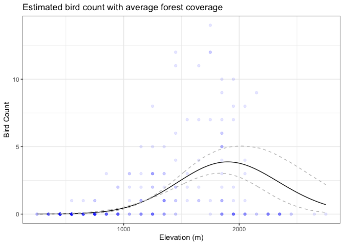

# Activity 13: key

Now reconsider the willow tit dataset and consider modeling not just the
presence / absence of birds, but directly modeling the number of birds
observed in each spatial region.

``` r
birds <- read.csv('http://math.montana.edu/ahoegh/teaching/stat491/data/willowtit2013_count.csv')
head(birds) |> 
  kable()
```

| siteID | elev | rlength | forest | bird.count | searchDuration |
|:-------|-----:|--------:|-------:|-----------:|---------------:|
| Q001   |  450 |     6.4 |      3 |          0 |            160 |
| Q002   |  450 |     5.5 |     21 |          0 |            190 |
| Q003   | 1050 |     4.3 |     32 |          3 |            150 |
| Q004   |  950 |     4.5 |      9 |          0 |            180 |
| Q005   | 1150 |     5.4 |     35 |          0 |            200 |
| Q006   |  550 |     3.6 |      2 |          0 |            115 |

This dataset contains 242 sites and 6 variables:

    - siteID, a unique identifier for the site, some were not sampled during this period 
    - elev, mean elevation of the quadrant in meters 
    - rlength, the length of the route walked by the birdwatcher, in kilometers 
    - forest, percent forest cover 
    - bird.count, number of birds identified 
    - searchDuration, time birdwatcher spent searching the site, in minutes

#### 1. Data Visualization

Create two figures that explore `bird.count` as a function of forest
cover percentage (`forest`) and elevation (`elev`) data visualization
that

``` r
birds |> 
  ggplot(aes(y = bird.count, x = forest)) + geom_point(alpha = .1) + 
  geom_smooth(method ='loess', formula = "y ~ x", se = F) +
  theme_bw() +
  ggtitle('Willow Tit count by % forest cover') + 
  ylab('Number of Birds') + 
  xlab("% Forest Cover") + 
  labs(caption = 'Blue curve is loess fit')
```


``` r
birds |>
  ggplot(aes(y = bird.count, x = elev)) + 
  geom_point(alpha = .1) + 
  geom_smooth(method ='loess', formula = "y ~ x", se = F) +
  theme_bw() +
  ggtitle('Willow Tit count by elevation') + 
  ylab('Number of Birds') + 
  xlab("Elevation (Meters)") + 
  labs(caption = 'Blue curve is loess fit')
```


#### 2. Model Specification

Using a Poisson regression model, clearly write out the model to
understand how forest cover and elevation impact bird count.

Note: variables will be standardized for this analysis.

#### 3. Priors

Describe and justify the necessary priors for this model.

*I anticipate these values being small, so normal priors centered at
zero with variance of 100 will be sufficient and minimally informative)*

#### 4. Fit MCMC

Fit the JAGS code for this model. You will have to put this together
following the specification in the previous examples, but the following
statement can be used for the sampling model portion.

``` r
model.string <- 'model {
  for (i in 1:Ntotal) {
    y[i] ~ dpois(mu[i])
    mu[i] <- exp(beta0 + sum( beta[1:Nx] * x[i,1:Nx] ))
  }
  # priors 
  beta0 ~ dnorm(0,1/5^2)
  for (j in 1:Nx){
    beta[j] ~ dnorm(0, 1/100^2)
  }
}'


birds <- birds |>
  mutate(std_elev = (elev - mean(elev)) / sd(elev),
         std_elev_sq = std_elev^2,
         std_forest = (forest - mean(forest)) / sd(forest),
         std_forest_sq = std_forest^2)


# Fit Model
jags.poiss <-  jags.model(textConnection(model.string), 
                  data=list(y=birds$bird.count,
                            Ntotal=nrow(birds), Nx = 4, 
                            x =  birds[,c('std_elev','std_elev_sq','std_forest','std_forest_sq')]), 
                             n.chains =2, n.adapt = 5000)
```

    Compiling model graph
       Resolving undeclared variables
       Allocating nodes
    Graph information:
       Observed stochastic nodes: 242
       Unobserved stochastic nodes: 5
       Total graph size: 2313

    Initializing model

``` r
update(jags.poiss, 10000)
samples <- coda.samples(jags.poiss, variable.names = c('beta','beta0'), n.iter = 10000) 
summary(samples)
```


    Iterations = 15001:25000
    Thinning interval = 1 
    Number of chains = 2 
    Sample size per chain = 10000 

    1. Empirical mean and standard deviation for each variable,
       plus standard error of the mean:

                Mean      SD  Naive SE Time-series SE
    beta[1]  2.35164 0.23186 0.0016395       0.009730
    beta[2] -1.02749 0.18529 0.0013102       0.007475
    beta[3]  1.38316 0.13414 0.0009485       0.003761
    beta[4] -0.70403 0.08668 0.0006129       0.002169
    beta0    0.05265 0.11669 0.0008251       0.002555

    2. Quantiles for each variable:

               2.5%      25%      50%     75%   97.5%
    beta[1]  1.9154  2.19111  2.34291  2.5073  2.8117
    beta[2] -1.4062 -1.14934 -1.02039 -0.9004 -0.6786
    beta[3]  1.1237  1.29270  1.38013  1.4725  1.6542
    beta[4] -0.8750 -0.76313 -0.70294 -0.6444 -0.5325
    beta0   -0.1799 -0.02616  0.05445  0.1315  0.2802

``` r
summary(glm(bird.count ~ std_elev + std_elev_sq + std_forest + std_forest_sq, family=poisson, data=birds))
```


    Call:
    glm(formula = bird.count ~ std_elev + std_elev_sq + std_forest + 
        std_forest_sq, family = poisson, data = birds)

    Coefficients:
                  Estimate Std. Error z value Pr(>|z|)    
    (Intercept)    0.07211    0.11653   0.619    0.536    
    std_elev       2.32176    0.22672  10.241  < 2e-16 ***
    std_elev_sq   -1.01020    0.18229  -5.542 3.00e-08 ***
    std_forest     1.36736    0.13227  10.337  < 2e-16 ***
    std_forest_sq -0.69504    0.08482  -8.194 2.52e-16 ***
    ---
    Signif. codes:  0 '***' 0.001 '**' 0.01 '*' 0.05 '.' 0.1 ' ' 1

    (Dispersion parameter for poisson family taken to be 1)

        Null deviance: 908.78  on 241  degrees of freedom
    Residual deviance: 308.86  on 237  degrees of freedom
    AIC: 557.92

    Number of Fisher Scoring iterations: 6

#### 5. Use posterior predictive distribution for model checking

- First extract posterior samples.

``` r
beta0 <- samples[[1]][,'beta0']
beta1 <- samples[[1]][,'beta[1]']
beta2 <- samples[[1]][,'beta[2]']
beta3 <- samples[[1]][,'beta[3]']
beta4 <- samples[[1]][,'beta[4]']
```

- Conditional on a single ‘X’ value, the 113th row in the dataset

``` r
pp_x1 <- rpois(10000,exp(beta0 + beta1 * birds$std_elev[113] + 
  beta2 * birds$std_elev_sq[113] +
  beta3 * birds$std_forest[113] +
  beta4 * birds$std_forest_sq[113]))

tibble(pp_x1 = pp_x1) |>
  ggplot(aes(x = pp_x1)) +
  geom_bar() +
  theme_bw() +
  xlab('') + 
  geom_vline(xintercept = birds$bird.count[113], color = 'red') +
  labs(caption = 'Histogram represents the posterior predictive distribution for the \n covariates associated with the 113th data point shown in red')
```


- Conditional on all data

``` r
x_sample <- birds[sample(1:nrow(birds), replace = T, size = 10000),]

pp_all <- rpois(10000,exp(beta0 + beta1 * x_sample$std_elev + 
  beta2 * x_sample$std_elev_sq +
  beta3 * x_sample$std_forest +
  beta4 * x_sample$std_forest_sq))

pp_fig <- tibble(pp_all = pp_all) |>
  ggplot(aes(x = pp_all)) +
  geom_bar(aes(y = after_stat(prop), group = 1)) +
  theme_bw() +
  xlab('') + 
  labs(caption = 'Posterior predictive distribution')

data_fig <- birds |>
  ggplot(aes(x = bird.count)) +
  geom_bar(aes(y = after_stat(prop), group = 1)) +
  theme_bw() +
  xlab('') +
  labs(caption = 'Data')
library(patchwork)

data_fig / pp_fig
```


#### 6. Summarize inferences from model

Talk about the model and discuss which and how predictor variables
influence the observed bird count.

**With squared terms, the interpretation of coefficients is a little
more complicated. However, we can start with the intercept.**

- $\beta_0$: can be interpreted as the expected bird count for an
  average elevation (1186 meters) and average forest coverage (36%). In
  particular exp($\beta_0$) = 1.0612448 (0.8, 1.3)

- For an average forest coverage, the mean impact of elevation can be
  visualized as



- For an average elevation, the impact of forest coverage can be
  visualized as


