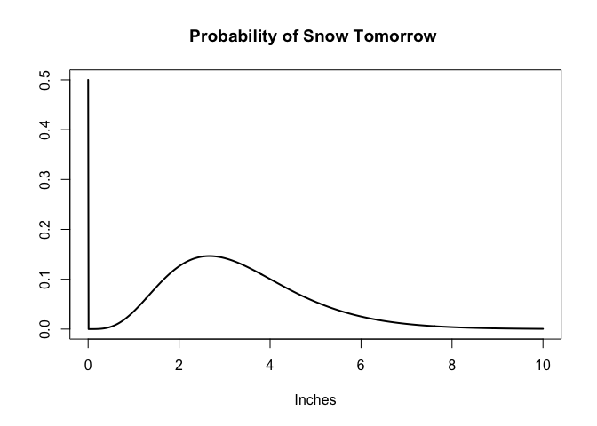

# Activity 2

### Week 1 Recap

- Bayesian thinking: Prior + data -\> updated beliefs
- Computing: R + JAGS = MCMC

------------------------------------------------------------------------

### Week 2 Overview: Credibility, Models, & Parameters

- Statistical models and associated parameters are used to explain
  stochastic processes

- Our prior credibility (or beliefs) are expressed as statistical
  distributions on model parameters

- Given data, distributional beliefs about parameters are updated
  mathematically using Bayes rule

------------------------------------------------------------------------

Consider the probability of measurable snow falling at MSU. Sketch a
prior belief on this probability.

Now, try to find a probability distribution that matches your sketch.
Note, you might want to explore the beta distribution (`dbeta()` or
`rbeta()`).

------------------------------------------------------------------------

In the context of the rolling Andy’s black die, sketch a prior belief on
the probabilities for the die resulting in a 6.

Now, try to find a probability distribution that matches your sketch.
Note, you might want to explore the beta distribution (`rbeta()`).

------------------------------------------------------------------------

Suppose you are interested in learning the about the average wait time
for the Sunnyside chair lift at Bridger Bowl on Saturday mornings at
9:00 AM. Outline the first three steps of a Bayesian inference:

1.  Identify the data relevant to the research question.

2.  Define a descriptive model (probability distribution) for the
    relevant data. Identify the statistical parameters in the analysis.

3.  Specify (plot and identify a distribution) a prior distribution for
    the parameters in the model.

------------------------------------------------------------------------

Interpret the following figure which specifies a prior distribution on
the snowfall total for tomorrow.

------------------------------------------------------------------------

#### Extra Fun

DBDA Exercise 2.1. \[Purpose: To get you actively manipulating
mathematical models of probabilities.\] Suppose we have a four-sided die
from a board game. On a tetrahedral die, each face is an equilateral
triangle. When you roll the die, it lands with one face down and the
other three faces visible as a three-sided pyramid. The faces are
numbered 1-4, with the value of the bottom face printed (as clustered
dots) at the bottom edges of all three visible faces. Denote the value
of the bottom face as x. Consider the following three mathematical
descriptions of the probabilities of x. Model A: p(x) = 1/4. Model B:
p(x) = x/10. Model C: p(x) = 12/(25x). For each model, determine the
value of p(x) for each value of x. Describe in words what kind of bias
(or lack of bias) is expressed by each model.

DBDA Exercise 2.2. \[Purpose: To get you actively thinking about how
data cause credibilities to shift.\] Suppose we have the tetrahedral die
introduced in the previous exercise, along with the three candidate
models of the die’s probabilities. Suppose that initially, we are not
sure what to believe about the die. On the one hand, the die might be
fair, with each face landing with the same probability. On the other
hand, the die might be biased, with the faces that have more dots
landing down more often (because the dots are created by embedding heavy
jewels in the die, so that the sides with more dots are more likely to
land on the bottom). On yet another hand, the die might be biased such
that more dots on a face make it less likely to land down (because maybe
the dots are bouncy rubber or protrude from the surface). So, initially,
our beliefs about the three models can be described as p(A) = p(B) =
p(C) = 1/3. Now we roll the die 100 times and find these results: \#1’s
= 25, \#2’s = 25, \#3’s = 25, \#4’s = 25. Do these data change our
beliefs about the models? Which model now seems most likely? Suppose
when we rolled the die 100 times we found these results: \#1’s = 48,
\#2’s = 24, \#3’s = 16, \#4’s = 12. Now which model seems most likely?

------------------------------------------------------------------------

Project Overview:

Start thinking about datasets for your project. A formal project
proposal will be coming soon.
