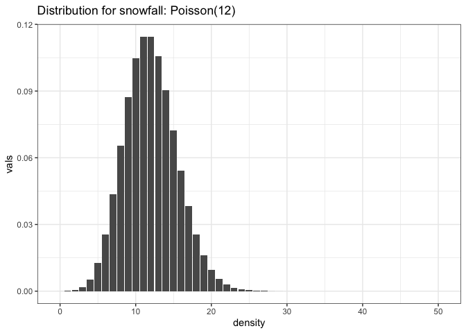
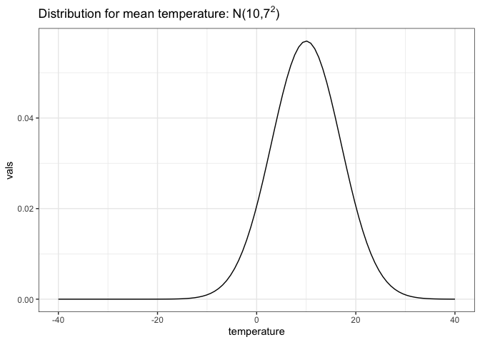

# Activity 3


### Week 2 Recap

- Priors: specifying credibility
- Beta Distributions
- Thinking through analyses:
  1.  Identify the data relevant to the research question,
  2.  Define a descriptive model (probability distribution) for the
      relevant data.
  3.  Identify the statistical parameters in the analysis.
- Hierarchical models

------------------------------------------------------------------------

### Week 3 Overview: Probability and Monte Carlo Techniques

- Probability and all possible outcomes

- Monte Carlo Techniques

- Probability mass functions and probability density functions

------------------------------------------------------------------------

Suppose we have a probability mass function for weekly winter snowfall
at Bridger Bowl that temperature in Hyalite that is Poisson with mean of
12 inches. This

``` r
library(tidyverse)
snow_seq <- 0:50
tibble(vals = c(dpois(snow_seq, 12)),
       `Weekly snowfall (inches)` = snow_seq) %>%
  ggplot(aes(x = `Weekly snowfall (inches)`, y = vals)) +
  geom_col() + 
  theme_bw() +
  xlab('density') +
  ggtitle(expression(paste('Distribution for snowfall: Poisson(12)')))
```



Answer the following questions with an numeric answer and a description
of why that answer is true.

- According to this distribution, what is the probability of a week
  having exactly 12 inches of snow?

- According to this distribution, what is the probability of a week
  having more than 12 inches of snow?

- According to this distribution, what is the probability of a week
  having 23 inches of snow (January 1 - January 7 this year)? Or 23 or
  more inches

- Based on the last question, do you have any concerns with this
  function for snowfall?

- What would be a 95% probability interval for the snowfall, under this
  distribution?

------------------------------------------------------------------------

Suppose we have a probability distribution for average temperature in
Hyalite that is Normal with mean = 10 and standard deviation = 7.

``` r
temp_seq <- seq(-40,40, length.out = 100)
tibble(vals = c(dnorm(temp_seq, 10, 7)),
       temperature = temp_seq) %>%
  ggplot(aes(x = temperature, y = vals)) +
  geom_line() + theme_bw() +
  ggtitle(expression(paste('Distribution for mean temperature: N(10,',7^2,')')))
```



Note that in Bayesian settings, we are trying to estimate $\mu$ and
$\sigma$ which leads to a hierarchical model

$$\text{Data Model:     } \; \; y \sim N(\mu, \sigma^2)$$
$$\text{Prior Model:     } \; \; \mu \sim N(\mu_0, \sigma_0^2 )$$
$$\text{Prior Model:     } \; \; \sigma \sim Gamma(a_\sigma, b_\sigma)$$
However, in this case we can assume that $\mu$ and $\sigma$ are known.

Answer the following questions with an numeric answer and a description
of why that answer is true.

- What is the probability that the temperature is greater than 10
  degrees?

- What is the probability that the temperature is less than 0 degrees?

- What is the probability that the temperature is exactly than 0
  degrees?

------------------------------------------------------------------------

Yahtzee is a dice game where players roll 5 dice. A yahtzee (all 5 dice
with the same value) is worth 50 points and a large straight (a run of 5
consecutive values) is worth 40 points. Use a Monte Carlo technique to
calculate the probability of each of these outcomes, given a single
roll.
