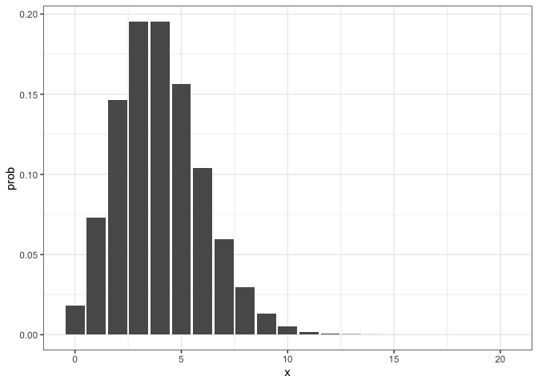
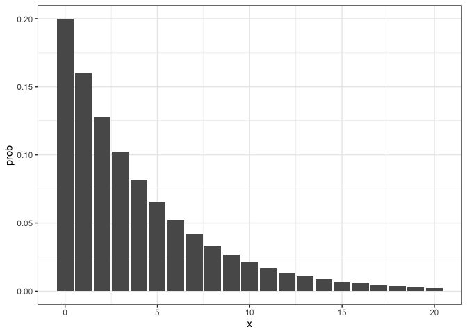
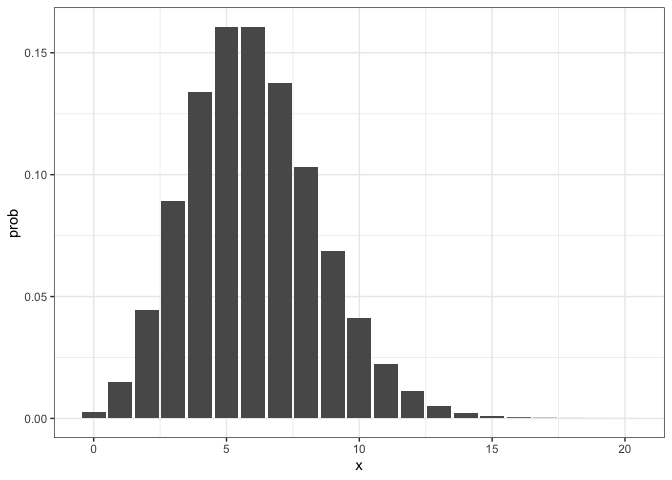

# Activity 4

### Week 3 Recap

- Thinking with distributions (intervals, mean, dispersion)

- Monte Carlo Techniques

- Probability mass functions and probability density functions

------------------------------------------------------------------------

### Week 4 Overview: Conditional Probability and Bayes Rule

- Marginal, Joint, Conditional Probability

- Bayes Rule

- Bayes Rule with data

------------------------------------------------------------------------

The highest density interval (HDI) corresponds to the shortest possible
interval, for a specified probability level. What would be the 95% HDI
for the following discrete distributions? Note with discrete
distributions you can calculate these exactly, but we can also use `hdi`
from `HDInterval` for approximate, Monte Carlo - based intervals

#### 1a. Poisson(4)

``` r
library(tidyverse)
library(knitr)
x_seq <- 0:20
pois4 <- tibble(x = x_seq, prob = dpois(x_seq,4)) 

pois4 %>%
  ggplot(aes(x=x,y=prob)) + geom_col() + theme_bw()
```



``` r
pois4 |>
  kable()
```

|   x |      prob |
|----:|----------:|
|   0 | 0.0183156 |
|   1 | 0.0732626 |
|   2 | 0.1465251 |
|   3 | 0.1953668 |
|   4 | 0.1953668 |
|   5 | 0.1562935 |
|   6 | 0.1041956 |
|   7 | 0.0595404 |
|   8 | 0.0297702 |
|   9 | 0.0132312 |
|  10 | 0.0052925 |
|  11 | 0.0019245 |
|  12 | 0.0006415 |
|  13 | 0.0001974 |
|  14 | 0.0000564 |
|  15 | 0.0000150 |
|  16 | 0.0000038 |
|  17 | 0.0000009 |
|  18 | 0.0000002 |
|  19 | 0.0000000 |
|  20 | 0.0000000 |

``` r
pois4 |>
  filter(x > 0, x <= 8) |>
  summarize(sum(prob))
```

    # A tibble: 1 × 1
      `sum(prob)`
            <dbl>
    1       0.960

This would be \[1, 8\]

``` r
library(HDInterval)

hdi(rpois(100000,4))
```

    lower upper 
        1     8 
    attr(,"credMass")
    [1] 0.95

#### 1b. NB(4, 100)

``` r
x_seq <- 0:20
nb4 <- tibble(x = x_seq, prob = dnbinom(x_seq,mu =4, size = 100)) 

nb4 %>%
  ggplot(aes(x=x,y=prob)) + geom_col() + theme_bw()
```


``` r
nb4 |>
  kable()
```

|   x |      prob |
|----:|----------:|
|   0 | 0.0198000 |
|   1 | 0.0761540 |
|   2 | 0.1479145 |
|   3 | 0.1934267 |
|   4 | 0.1915668 |
|   5 | 0.1532534 |
|   6 | 0.1031513 |
|   7 | 0.0600772 |
|   8 | 0.0309051 |
|   9 | 0.0142639 |
|  10 | 0.0059799 |
|  11 | 0.0022999 |
|  12 | 0.0008182 |
|  13 | 0.0002711 |
|  14 | 0.0000842 |
|  15 | 0.0000246 |
|  16 | 0.0000068 |
|  17 | 0.0000018 |
|  18 | 0.0000004 |
|  19 | 0.0000001 |
|  20 | 0.0000000 |

``` r
nb4 |>
  filter(x > 0, x <= 8) |>
  summarize(sum(prob))
```

    # A tibble: 1 × 1
      `sum(prob)`
            <dbl>
    1       0.956

This would be approximately \[1,8\]

``` r
hdi(rnbinom(100000, mu =4, size = 100))
```

    lower upper 
        1     8 
    attr(,"credMass")
    [1] 0.95

#### 1c. NB(4, 1)

``` r
x_seq <- 0:20
nb4_1 <- tibble(x = x_seq, prob = dnbinom(x_seq,mu =4, size = 1)) 
nb4_1 %>%
  ggplot(aes(x=x,y=prob)) + geom_col() + theme_bw()
```



``` r
nb4_1 |> kable()
```

|   x |      prob |
|----:|----------:|
|   0 | 0.2000000 |
|   1 | 0.1600000 |
|   2 | 0.1280000 |
|   3 | 0.1024000 |
|   4 | 0.0819200 |
|   5 | 0.0655360 |
|   6 | 0.0524288 |
|   7 | 0.0419430 |
|   8 | 0.0335544 |
|   9 | 0.0268435 |
|  10 | 0.0214748 |
|  11 | 0.0171799 |
|  12 | 0.0137439 |
|  13 | 0.0109951 |
|  14 | 0.0087961 |
|  15 | 0.0070369 |
|  16 | 0.0056295 |
|  17 | 0.0045036 |
|  18 | 0.0036029 |
|  19 | 0.0028823 |
|  20 | 0.0023058 |

``` r
nb4_1 |>
  filter(x <= 13) |>
  summarize(sum(prob))
```

    # A tibble: 1 × 1
      `sum(prob)`
            <dbl>
    1       0.956

This would be approximately \[0, 13\]

``` r
hdi(rnbinom(100000, mu =4, size = 1))
```

    lower upper 
        0    13 
    attr(,"credMass")
    [1] 0.95

#### 1d. Pois(6)

``` r
x_seq <- 0:20
pois6 <- tibble(x = x_seq, prob = dpois(x_seq,6)) 

pois6 %>%
  ggplot(aes(x=x,y=prob)) + geom_col() + theme_bw()
```



``` r
pois6 |>
  kable()
```

|   x |      prob |
|----:|----------:|
|   0 | 0.0024788 |
|   1 | 0.0148725 |
|   2 | 0.0446175 |
|   3 | 0.0892351 |
|   4 | 0.1338526 |
|   5 | 0.1606231 |
|   6 | 0.1606231 |
|   7 | 0.1376770 |
|   8 | 0.1032577 |
|   9 | 0.0688385 |
|  10 | 0.0413031 |
|  11 | 0.0225290 |
|  12 | 0.0112645 |
|  13 | 0.0051990 |
|  14 | 0.0022281 |
|  15 | 0.0008913 |
|  16 | 0.0003342 |
|  17 | 0.0001180 |
|  18 | 0.0000393 |
|  19 | 0.0000124 |
|  20 | 0.0000037 |

``` r
pois6 |>
  filter(x >=2 , x <= 11) |>
  summarize(sum(prob))
```

    # A tibble: 1 × 1
      `sum(prob)`
            <dbl>
    1       0.963

This would be \[2, 11\]

``` r
library(HDInterval)

hdi(rpois(100000,6))
```

    lower upper 
        1    10 
    attr(,"credMass")
    [1] 0.95

------------------------------------------------------------------------

Use a dataset containing homes in the Seattle, WA area
<http://www.math.montana.edu/ahoegh/teaching/stat408/datasets/SeattleHousing.csv>
for this question.

``` r
seattle <- read_csv('http://www.math.montana.edu/ahoegh/teaching/stat408/datasets/SeattleHousing.csv') %>%
  mutate(bath_category = case_when(
    bathrooms <= 2 ~ '0 - 2',
    bathrooms > 2 & bathrooms <=4 ~ '2 - 4',
    bathrooms > 4 ~ 'more than 4'),
    bed_category = case_when(
    bedrooms == 0 ~ '0',
    bedrooms > 0 & bedrooms <= 2 ~ '1-2',
    bedrooms > 2 & bedrooms <= 4 ~ '3-4',
    bedrooms > 4 ~ 'more than 5'
   )
  )
```

    Rows: 869 Columns: 14
    ── Column specification ────────────────────────────────────────────────────────
    Delimiter: ","
    dbl (14): price, bedrooms, bathrooms, sqft_living, sqft_lot, floors, waterfr...

    ℹ Use `spec()` to retrieve the full column specification for this data.
    ℹ Specify the column types or set `show_col_types = FALSE` to quiet this message.

Use the two-by-two table containing bathrooms (grouped as: 0 - 2, more
than 2 - 4, more than 4) and bedrooms (0, 1-2, 3-4, 5 or more).

``` r
table(seattle$bath_category, seattle$bed_category) 
```

                 
                    0 1-2 3-4 more than 5
      0 - 2         3 129 332          13
      2 - 4         0  22 314          32
      more than 4   0   0  10          14

``` r
round(table(seattle$bath_category, seattle$bed_category) / nrow(seattle),3)
```

                 
                      0   1-2   3-4 more than 5
      0 - 2       0.003 0.148 0.382       0.015
      2 - 4       0.000 0.025 0.361       0.037
      more than 4 0.000 0.000 0.012       0.016

#### 2a.

Compute marginal probability of having 0 - 2 bathrooms

The probability is 0.548

#### 2b.

Compute joint probability of having 0 - 2 bathroom and 3-4 bedrooms

The probability is .382

#### 2c.

Compute conditional probability of having 3-4 bedrooms given that it has
0 - 2 bathrooms

The probability is 0.697

#### 2d.

Are bathrooms and bedrooms independent? Why or why not.

*No the probability of the number of bedrooms depends on the number of
bathrooms. In particular there are different values for parts a and c.*

------------------------------------------------------------------------

(DBDA 4.5B)

Use a normal curve to describe the following belief. Suppose you believe
that women’s heights follow a bell-shaped distribution, centered at 162
cm with about 2/3rds of all women having heights between 147 and 177.
What should be the $\mu$ and $\sigma$ values?

- $\mu$ = 162
- $\sigma$ = 15 (as about 2/3rd of observations fall within 1 sd of the
  mean)

------------------------------------------------------------------------

Assume your roommate has taken, and tested positive, for an at home
antigen Covid test. Let’s assume the test was from Cochrane
(data)\[https://www.cochrane.org/CD013705/INFECTN_how-accurate-are-rapid-antigen-tests-diagnosing-covid-19\]
with the following properties:

- P\[Test = + \| Disease = +\] = .82
- PP\[Test = - \| Disease = -\] = .995

#### 4a.

If the overall population prevalence was 5%, what is the probability
that your roommate has COVID-19?

``` r
p.t.plus <- .82
p.t.minus <- 1 - .995
p.theta <- .05
p.theta.true <- p.t.plus * p.theta / (p.t.plus * p.theta + p.t.minus * (1 - p.theta))
```

The probability would be about 0.896.

#### 4b.

Now assume that your other roommate took a test (with the same
characteristics) and that test was negative. What is the probability the
other roommate has COVID-19?

``` r
p.t.plus <- .82
p.t.minus <- 1 - .995
p.theta <- .05
p.theta.neg <- (1 - p.t.plus) * (p.theta) / ((1 - p.t.minus) * (1- p.theta) + (1 - p.t.plus) * (p.theta))
```

The probability would be about 0.009
