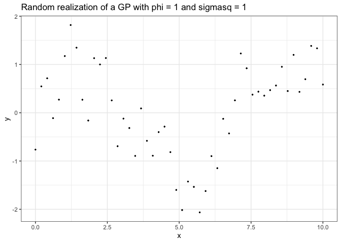
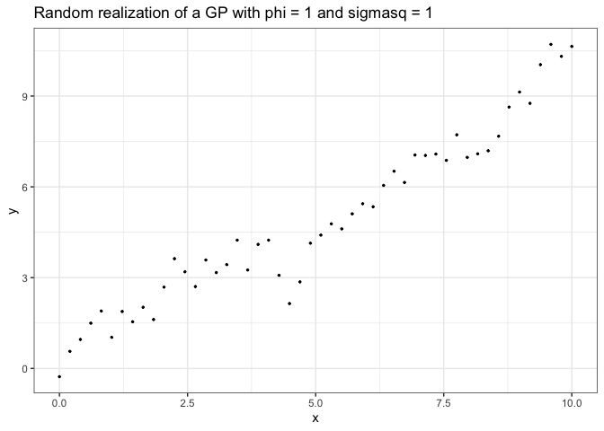
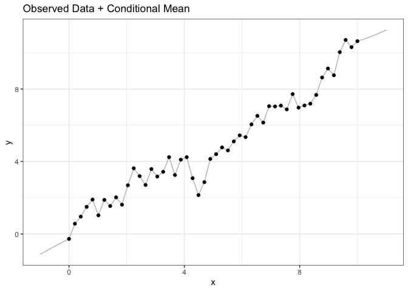
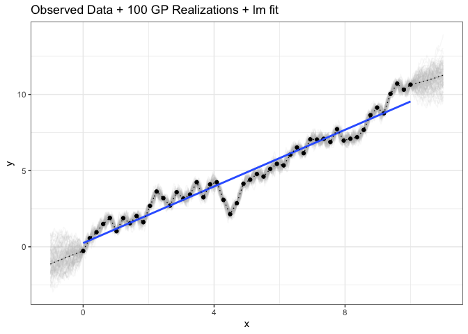
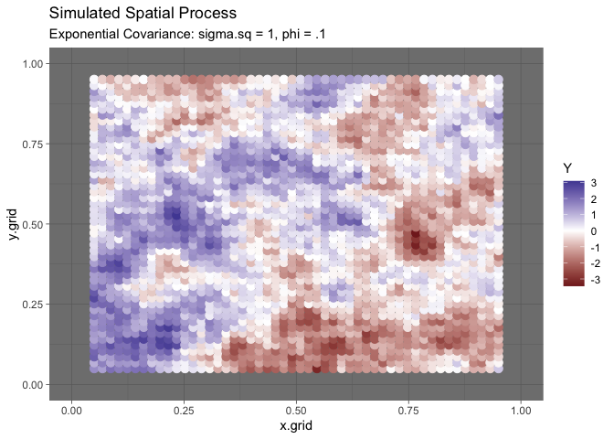

# Bayes Bonus Activity


### Road Map

- Bayes can be used in any modeling scenario

  - non-informative priors will give similar (numerical results) with
    Bayes interpretation
  - there are several R packages that make easy implementation of
    Bayesian methods possible `brms` and `rstanarm` are two that I’ve
    used.

- Priors naturally provide regularization, which amongst other things
  avoids issues like separation

- Transformations of posterior samples, consider `log(swe)`
  $\rightarrow$ `swe`

- More GLMs

  - Any probability distribution can be used here, depending on the
    structure of the data

- Mixture Models and Zero inflated models

- Correlated data

- Spatial & temporal data

- State space models

- Gaussian processes

#### GP in 1D

Consider a simulated Gaussian process in 1D

``` r
phi <- 1
sigmasq <- 1
n <- 50
x <- seq(0, 10, length.out = n)
d <- sqrt(plgp::distance(x))
eps <- sqrt(.Machine$double.eps)
H <- exp(-d/phi) + diag(eps, n)
y <- rmnorm(1, rep(0,n),sigmasq * H)
tibble(y = y, x = x) %>% ggplot(aes(y=y, x=x)) +
  theme_bw() + ggtitle('Random realization of a GP with phi = 1 and sigmasq = 1') +
  geom_point(size = .5)
```



We have simulated y ~ N(mu, sigmasq \* H(phi)), where H(phi) is a
correlation matrix from exp(-d/phi).

##### STAN CODE

Here is stan code to estimate phi, sigmasq and mu

    data {
      int<lower=0> N; // number of data points
      vector[N] y; // responds
      matrix[N,N] dist; // distance matrix
    }

    parameters {
      real<lower = 0.5, upper = 9.8> phi;
      real<lower = 0> sigmasq;
      real mu;
    }

    transformed parameters{
      vector[N] mu_vec;
      corr_matrix[N] Sigma;

      for(i in 1:N) mu_vec[i] = mu;
      for(i in 1:(N-1)){
       for(j in (i+1):N){
         Sigma[i,j] = exp((-1)*dist[i,j]/ phi);
         Sigma[j,i] = Sigma[i,j];
       }
     }
     for(i in 1:N) Sigma[i,i] = 1;

    }

    model {
      y ~ multi_normal(mu_vec ,sigmasq * Sigma);
      phi ~ inv_gamma(10,10);
      sigmasq ~ inv_gamma(10,10);
      mu ~ normal(0, 10);
    }

``` r
GP_params <- stan("GP1d.stan",
                  data=list(N = n,
                            y = y,
                            dist = d),
                  iter = 5000)
```

``` r
print(GP_params, pars = c('phi', 'mu','sigmasq'))
```

    Inference for Stan model: anon_model.
    4 chains, each with iter=5000; warmup=2500; thin=1; 
    post-warmup draws per chain=2500, total post-warmup draws=10000.

            mean se_mean   sd  2.5%   25%  50%  75% 97.5% n_eff Rhat
    phi     1.03    0.00 0.26  0.65  0.85 1.00 1.17  1.66  5290    1
    mu      0.02    0.01 0.44 -0.86 -0.26 0.02 0.31  0.95  4950    1
    sigmasq 1.11    0.00 0.26  0.71  0.92 1.07 1.25  1.71  4809    1

    Samples were drawn using NUTS(diag_e) at Wed Apr 30 11:33:17 2025.
    For each parameter, n_eff is a crude measure of effective sample size,
    and Rhat is the potential scale reduction factor on split chains (at 
    convergence, Rhat=1).

#### GP regression in 1D

Now add a covariate

``` r
phi <- 1
sigmasq <- 1
n <- 50
x <- seq(0, 10, length.out = n)
beta <- 1
d <- sqrt(plgp::distance(x))
eps <- sqrt(.Machine$double.eps)
H <- exp(-d/phi) + diag(eps, n)
y <- rmnorm(1, x * beta,sigmasq * H)
reg_fig <- tibble(y = y, x = x) %>% ggplot(aes(y=y, x=x)) +
  theme_bw() + ggtitle('Random realization of a GP with phi = 1 and sigmasq = 1') +
  geom_point(size = .5)
reg_fig
```



We have simulated y ~ N(mu, sigmasq \* H(phi)), where H(phi) is a
correlation matrix from exp(-d/phi).

##### STAN CODE

    data {
      int<lower=0> N; // number of data points
      vector[N] y; // response
      matrix[N,N] dist; // distance matrix
      vector[N] x; // covariate
    }

    parameters {
      real<lower = 0.5, upper = 9.8> phi;
      real<lower = 0> sigmasq;
      real beta;
    }

    transformed parameters{
      vector[N] mu_vec;
      corr_matrix[N] Sigma;

      for(i in 1:N) mu_vec[i] = x[i] * beta;
      for(i in 1:(N-1)){
       for(j in (i+1):N){
         Sigma[i,j] = exp((-1)*dist[i,j]/ phi);
         Sigma[j,i] = Sigma[i,j];
       }
     }
     for(i in 1:N) Sigma[i,i] = 1;

    }

    model {
      y ~ multi_normal(mu_vec ,sigmasq * Sigma);
      phi ~ inv_gamma(10,10);
      sigmasq ~ inv_gamma(10,10);
      beta ~ normal(0, 10);
    }

``` r
Reg_params <- stan("GP_reg.stan",
                  data=list(N = n,
                            y = y,
                            x = x,
                            dist = d),
                  iter = 5000)
```

``` r
print(Reg_params, pars = c('phi', 'beta','sigmasq'))
```

    Inference for Stan model: anon_model.
    4 chains, each with iter=5000; warmup=2500; thin=1; 
    post-warmup draws per chain=2500, total post-warmup draws=10000.

            mean se_mean   sd 2.5%  25%  50%  75% 97.5% n_eff Rhat
    phi     1.38    0.01 0.44 0.74 1.07 1.31 1.61  2.43  7664    1
    beta    0.99    0.00 0.07 0.86 0.95 0.99 1.04  1.13  8437    1
    sigmasq 0.81    0.00 0.20 0.50 0.67 0.78 0.92  1.30  8511    1

    Samples were drawn using NUTS(diag_e) at Wed Apr 30 11:55:04 2025.
    For each parameter, n_eff is a crude measure of effective sample size,
    and Rhat is the potential scale reduction factor on split chains (at 
    convergence, Rhat=1).

##### Making Predictions

``` r
beta_hat <- summary(Reg_params, pars = 'beta')$summary[1]
sigmasq_hat <- summary(Reg_params, pars = 'sigmasq')$summary[1]
phi_hat <- summary(Reg_params, pars = 'phi')$summary[1]
xnew <- seq(-1, 11, .025)
n_pred <- length(xnew)
d1 <- sqrt(plgp::distance(xnew))
Sigma11 <- sigmasq_hat * exp(-d1/phi_hat) + diag(eps, n_pred)
d12 <- sqrt(plgp::distance(xnew,x))
Sigma12 <- sigmasq_hat * exp(-d12/phi_hat)
Sigma22 <- sigmasq_hat * exp(-d/phi_hat) + diag(eps, n)

mu_1given2 <- xnew * beta_hat + Sigma12 %*% solve(Sigma22) %*% matrix(y - x * beta_hat, nrow = length(y), ncol = 1)
Sigma_1given2 <- Sigma11 - Sigma12 %*% solve(Sigma22) %*% t(Sigma12)
```



``` r
num_sims <- 100
y1_sims <- rmnorm(num_sims, mu_1given2, Sigma_1given2  )

long_sims <- y1_sims %>% melt() %>% bind_cols(tibble(x = rep(xnew, each = num_sims)))

data_and_mean +
  geom_line(aes(y = value, x = x, group = Var1), inherit.aes = F,
            data = long_sims, alpha = .1, color = 'gray') +
  ggtitle('Observed Data + 100 GP Realizations + lm fit') + geom_point() + geom_smooth(method ='lm', formula = 'y~x', se = F) +
  geom_line(aes(y = y_mean, x = xnew), inherit.aes = F, data = mean_line, color = 'black', linetype = 3)
```



### Geostatistical Data

Simulated 2-d “spatial” data.

##### 1. Create Sampling Locations

``` r
#set.seed(03062025)

dim.grid <- 50
grid.coords <- data.frame(x.grid = rep(seq(.05, .95, length.out=dim.grid), dim.grid),
  y.grid = rep(seq(.05, .95, length.out = dim.grid), each = dim.grid))

dist.grid <- sqrt(plgp::distance(grid.coords))

sigma.sq <- 1
phi <- .1
Sigma <- sigma.sq * exp(- dist.grid/phi) + diag(eps, dim.grid ^ 2) 

Y <- rmnorm(n=1, mean = 0, varcov = Sigma  )

grid.coords %>% mutate(Y = Y) %>% ggplot(aes(x=x.grid,y=y.grid)) + geom_point(aes(color=Y), size=3) + ggtitle('Simulated Spatial Process', subtitle = 'Exponential Covariance: sigma.sq = 1, phi = .1') + xlim(0,1) + ylim(0,1) +   scale_colour_gradient2() + theme_dark()
```


