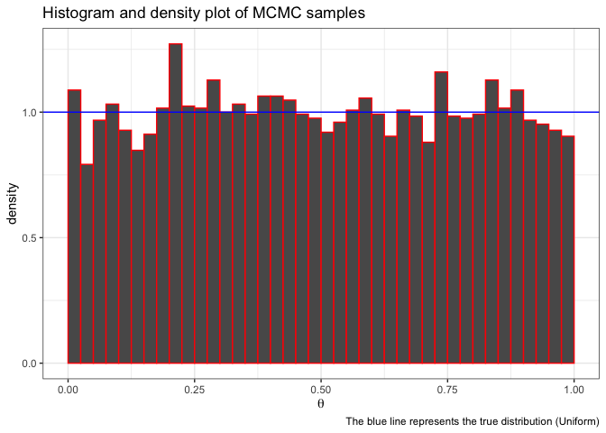
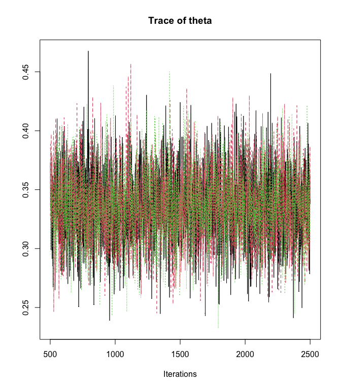
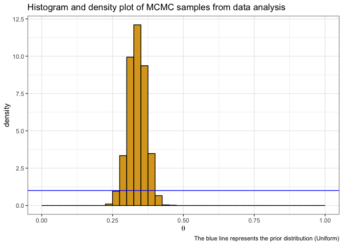

# STAT 456: Computing Intro

### Demo Goals:

- Working version of R / R Studio
- Understand quarto document functionality
- Brief primer in tidyverse / ggplot
- Have working implementation of Jags
- Rudimentary understanding of Jags functionality

------------------------------------------------------------------------

#### 1. Update R and R Studio

The current version of R is 4.4.2, I’d recommend updating R if you are
more than one or two versions out of date.

My current procedure is I download a new version of R and R Studio at
the start of each semester.

[download R](https://cloud.r-project.org)

[download R Studio](https://posit.co/download/rstudio-desktop/) - you’ll
also periodically be asked if you’d like to update R Studio if you open
an older version.

------------------------------------------------------------------------

#### 2. Install JAGS

JAGS (Just Another Gibbs Sampler) is a program for running the Markov
Chain Monte Carlo (MCMC) algorithm. We will primarily access JAGS using
the `rjags` package in R

First, [download JAGS](https://sourceforge.net/projects/mcmc-jags/)

Second, install and load the rjags package

``` r
#install.packages('rjags')
library(rjags)
```

    Loading required package: coda

    Linked to JAGS 4.3.2

    Loaded modules: basemod,bugs

------------------------------------------------------------------------

#### 3. Simple JAGS code

This simplified JAGS code will draw samples from a beta distribution.

``` r
library(rjags)
library(tidyverse)
```

    ── Attaching core tidyverse packages ──────────────────────── tidyverse 2.0.0 ──
    ✔ dplyr     1.1.4     ✔ readr     2.1.5
    ✔ forcats   1.0.0     ✔ stringr   1.5.1
    ✔ ggplot2   3.5.1     ✔ tibble    3.2.1
    ✔ lubridate 1.9.3     ✔ tidyr     1.3.1
    ✔ purrr     1.0.2     
    ── Conflicts ────────────────────────────────────────── tidyverse_conflicts() ──
    ✖ dplyr::filter() masks stats::filter()
    ✖ dplyr::lag()    masks stats::lag()
    ℹ Use the conflicted package (<http://conflicted.r-lib.org/>) to force all conflicts to become errors

Specify the model as a text variable.

``` r
modelString = "
  model {
    theta ~ dbeta( 1 , 1 ) 
  }
"
writeLines( modelString, con='theta.txt')
```

Generate MCMC chains. Now we call the JAGS code to run the MCMC. The
`jags.model()` function takes: a file containing the model specification

``` r
set.seed(01152025)
jagsModel <- jags.model( file = "theta.txt",
                         n.adapt = 500)
```

    Compiling model graph
       Resolving undeclared variables
       Allocating nodes
    Graph information:
       Observed stochastic nodes: 0
       Unobserved stochastic nodes: 1
       Total graph size: 2

    Initializing model

``` r
codaSamples <- coda.samples(jagsModel,
                             variable.names = c('theta'), 
                            n.iter = 5000)
summary(codaSamples)
```


    Iterations = 1:5000
    Thinning interval = 1 
    Number of chains = 1 
    Sample size per chain = 5000 

    1. Empirical mean and standard deviation for each variable,
       plus standard error of the mean:

              Mean             SD       Naive SE Time-series SE 
          0.499589       0.286206       0.004048       0.004048 

    2. Quantiles for each variable:

       2.5%     25%     50%     75%   97.5% 
    0.02259 0.25234 0.49570 0.74904 0.97290 

Now create a figure (using ggplot2) to plot the iterations in
`codaSamples`. Do you recognize this distribution?

``` r
tibble(theta = as.numeric(codaSamples[[1]])) |>
  ggplot(aes( x = theta)) + 
  geom_histogram(aes(y = after_stat(density)), color = 'red', breaks = seq(0, 1, by = .025)) +
  theme_bw() +
  xlab(expression(theta)) + 
  labs(title = 'Histogram and density plot of MCMC samples',
       caption = 'The blue line represents the true distribution (Uniform)') + 
  geom_hline(yintercept = 1, color = 'blue')
```



------------------------------------------------------------------------

#### 4. Run JAGS code using data

Consider data collected on a willow tit


1.  Load the data and place it in a list object. The list will
    eventually be passed to JAGS.

``` r
library(rjags)
library(tidyverse)
birds <- read_csv('http://www.math.montana.edu/ahoegh/teaching/stat491/data/willowtit2013.csv')
```

    Rows: 242 Columns: 6
    ── Column specification ────────────────────────────────────────────────────────
    Delimiter: ","
    chr (1): siteID
    dbl (5): elev, rlength, forest, birds, searchDuration

    ℹ Use `spec()` to retrieve the full column specification for this data.
    ℹ Specify the column types or set `show_col_types = FALSE` to quiet this message.

**Q** What proportion of the sites had at least one bird present?

``` r
bird_presence <- birds |>
  summarize(mean(birds > 0)) |>
  pull()
```

33% of the sites had at least one bird present.

Now consider a Bayesian analysis designed to estimate the proportion of
sites that are occupied by birds

``` r
y <- birds$birds
N <- nrow(birds) # count number of trials
dataList = list(y = y, Ntotal = N)
```

2.  Specify the model as a text variable. While the code looks vaguely
    familiar, it to is executed in JAGS. The model statement contains
    the likelihood piece, $p(y|\theta)$, written as a loop through the
    $N$ Bernoulli observations and the prior, $p(\theta)$. Finally the
    model is bundled as a .txt object.

``` r
modelString = "
  model {
    for ( i in 1:Ntotal ) {
      y[i] ~ dbern( theta ) # likelihood
    }
    theta ~ dbeta( 1 , 1 ) # prior
  }
"
writeLines( modelString, con='beta_binomial.txt')
```

3.  Initialize the chains by specifying a starting point. This is akin
    to stating which island the politician will start on. It is often
    advantageous to run a few chains with different starting points to
    verify that they have the same end results.

``` r
initsList <- function(){
  # function for initializing starting place of theta
  # RETURNS: list with random start point for theta
  return(list(theta = runif(1)))
}
```

4.  Generate MCMC chains. Now we call the JAGS code to run the MCMC. The
    `jags.model()` function takes:

    - a file containing the model specification
    - the data list
    - the list containing the initialized starting points
    - the function also permits running multiple chains, `n.chain`,
    - `n.adapt` works to tune the algorithm.

    ``` r
    jagsModel <- jags.model( file = "beta_binomial.txt", data = dataList, inits =initsList,
                             n.chains =3, 
                             n.adapt = 500)
    ```

        Compiling model graph
           Resolving undeclared variables
           Allocating nodes
        Graph information:
           Observed stochastic nodes: 242
           Unobserved stochastic nodes: 1
           Total graph size: 245

        Initializing model

    ``` r
    update(jagsModel, n.iter = 500)
    ```

The `update` statement results in what is called the burn in period,
which is essentially tuning the algorithm and those samples are
ultimately discarded. Now we can run the algorithm for a little longer.

``` r
codaSamples <- coda.samples( jagsModel, variable.names = c('theta'), n.iter =2000)
```

5.  Examine the results. Finally we can look at our chains to evaluate
    the results.

``` r
HPDinterval(codaSamples)
```

    [[1]]
             lower     upper
    theta 0.275374 0.3961413
    attr(,"Probability")
    [1] 0.95

    [[2]]
             lower     upper
    theta 0.282193 0.3987824
    attr(,"Probability")
    [1] 0.95

    [[3]]
              lower     upper
    theta 0.2737337 0.3924991
    attr(,"Probability")
    [1] 0.95

``` r
summary(codaSamples)
```


    Iterations = 501:2500
    Thinning interval = 1 
    Number of chains = 3 
    Sample size per chain = 2000 

    1. Empirical mean and standard deviation for each variable,
       plus standard error of the mean:

              Mean             SD       Naive SE Time-series SE 
         0.3360847      0.0304915      0.0003936      0.0004097 

    2. Quantiles for each variable:

      2.5%    25%    50%    75%  97.5% 
    0.2775 0.3156 0.3354 0.3565 0.3969 

``` r
traceplot(codaSamples)
```



Again, visualize the results.

``` r
tibble(theta = as.numeric(codaSamples[[1]])) |>
  ggplot(aes( x = theta)) + 
  geom_histogram(aes(y = after_stat(density)), fill = 'goldenrod',color = 'black', breaks = seq(0, 1, by = .025)) +
  theme_bw() +
  xlab(expression(theta)) + 
  labs(title = 'Histogram and density plot of MCMC samples from data analysis',
       caption = 'The blue line represents the prior distribution (Uniform)') + 
  geom_hline(yintercept = 1, color = 'blue')
```


